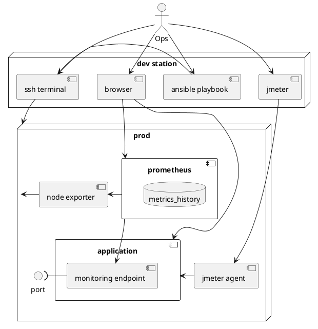

Java Application Monitoring and Troubleshooting Basics
======================================================
_4. Java Application as a Runtime White Box: App running, JVM and application monitoring, troubleshooting, faults analysing and tuning._ 24 hrs / 3 days.

# Training Objectives
- [ ] Understanding modern application architecture and defect hotspots
- [ ] Understanding JVM classes, memory and threading architecture
- [ ] Hands-on skill of monitoring modern applications
- [ ] Understanding modern IO architecture and its pitfalls
- [ ] Hands-on skill of monitoring persistent data-driven applications

# Prerequisites
## Hardware
- [ ] RAM ≥ 8Гб
- [ ] Wi-Fi with Internet access
## Software at student's developer station
- [ ] [git](https://git-scm.com/downloads)
- [ ] [JDK8](https://www.oracle.com/technetwork/java/javase/downloads/jdk8-downloads-2133151.html)
- [ ] [Ansible for *nix](https://docs.ansible.com/ansible/latest/installation_guide/index.html) or [Ansible for Windows](https://geekflare.com/ansible-installation-windows/)
- [ ] [JMeter](https://jmeter.apache.org/download_jmeter.cgi)
- [x] [Docker](https://www.docker.com/products/docker-desktop)
## Network access from student stations _to_ emulation of **prod** host
- [ ] [prod](/iaac/inventories/production/hosts.yml) accessible
- [ ] Ports at {{ prod }}[:ports_needed](/iaac/inventories/test/test-env-docker-compose.yml) accessible
## Network Access from student stations _and_ prod host
- [ ] github.org :443 :80
- [ ] repo1.maven.org :443 :80
- [ ] jcenter.bintray.com :443 :80
- [ ] hub.docker.com :443 :80

# Agenda
_* starred items and checked checklist items are **optional**_

## Training introducing and focusing (15m)
- [ ] Schedule
- [ ] Trainer
- [ ] Training overview
- [ ] Rules

## Hands-on: Teams and their demand (15m)
- [ ] Pairs forming and introduction
- [ ] Attendees prerequisites check
- [ ] Topics focus demand from attendees
- [ ] Additional topics demand form attendees

## Java Platform crash course (2h)
<!--- TODO Rosetta stone visuals: concept - metaphor - code -->
### Why Java?
- [ ] Platform Goals
- [ ] JVM
- [ ] JRE
- [ ] JDK
### What do any application doing?
- [ ] Data input
- [ ] Data processing
- [ ] Data storing
- [ ] Data output
### How we do model the data?
- [ ] Primitive Types
- [ ] Structures with class and enum
### How we do model the behavior?
- [ ] OOAD overview
- [ ] Types: class, abstract class, interface
- [ ] Methods and call stack
### How do we implement application? Key concepts
- [ ] Working with _class_: dynamic classloading
- [ ] Working with _instance and its reference_: create and GC
- [ ] Working with _thread_: Thread API, states, pooling
### Where data is stored? Core data scopes
- [ ] Local/method/stack variables
- [ ] Object properties/state: request, thread-local, session, singleton/application
- [ ] Persistent: file, embedded/local database
- [ ] Integration: remote filesystem, remote database, remote system procedure call, remote message queue
### [Teamwork](#teamwork-nfrs-and-metrics-checklist-15m)
### How do we build an application?
- [ ] Phisical point ov view for java application
- [ ] Classes, packages and JARs
- [ ] classpath x2
- [ ] Build cycle raw
- [ ] Build cycle with Maven
### How do we run an application?
- [ ] Run with JVM
- [ ] Ways for application run-time parameterization: jvm parameters, program arguments, sys/app properties
- [ ] Key JVM parameters for memory setup
### How do we monitor a java application internals?
- [ ] JMX simple tooling demo: JVisualVM
- [ ] JMX architecture overview
### [Hands-on](#hands-on-simple-application-local-building-running-and-monitoring-30m)

## Teamwork: NFRs and metrics checklist (15m)
- [ ] What Quality Attributes/NFRs does JVM provide for application?
- [ ] What Quality Attributes/NFRs do we satisfy with application monitoring?
- [ ] Start metrics [checklist](METRICS-CHECKLIST.md) by tier: JVM metrics

## Hands-on: Simple application _local_ building, running and monitoring (30m)
### Given
- [ ] Satisfied [prerequisites](#Prerequisites) 
- [ ] **Forked** simple project [codebase](https://github.com/eugene-krivosheyev/java-application-monitoring-and-troubleshooting) 
- [ ] Cloned fork locally
```shell script
cd
git clone https://github.com/{{ STUDENT_ACCOUNT }}/java-application-monitoring-and-troubleshooting
cd java-application-monitoring-and-troubleshooting
git checkout {{ group_custom_branch }}
```
### When
- [ ] Project application built locally with maven
```shell script
mvn clean verify [-DskipTests]
```
- [ ] Project application ran locally with CLI
```shell script
java \
  -Xms128m -Xmx256m \
  -cp target/dbo-1.0-SNAPSHOT.jar \
  -Dapp.property=value \
  com.acme.dbo.Presentation \
  program arguments
```
- [ ] JVisualVM profiler connected to running app
```shell script
$JAVA_HOME/bin/jvisualvm
```
- [ ] OS-specific monitoring tool shows application process details
```shell script
linux$ top [-pid jvmpid]
windows> taskmgr
```
### Then answered and reviewed at debrief
- [ ] What is the default encoding for I/O?
- [ ] What is the default heap size for app running?
- [ ] How many java threads is active within JVM? 
- [ ] How many OS threads is active within OS JVM process? 
- [ ] What is the minimal possible heap size for app running?
- [x] What is the difference for profiler times: Self time/Total time, CPU time?

---

## Modern applications architecture and deployment: What tiers do we monitor? (1h)
| Tier 
|------
| Application Layers: UI/P, API/C, BL/S, DAL/R
| Application caching 
| Thread Pool 
| JPA Caching
| JPA subsystem 
| Connection Pools
| JDBC subsystem 
| Framework configuration with profiles
| Framework for Spring modules management  
| Framework for Web/SOAP/REST application expose
| Framework for Application
| Application Server/Servlet Container 
| JVM: application debug API
| JVM: application profiling API
| JVM: universal monitoring API
| JVM: threads, IO
| JVM: memory, GC
| JVM: process 
| Container: Networking
| Container: Core
| Message queues
| DBMS
| OS: Threads
| OS: Processes
| Hardware: HDD/SSD
| Hardware: RAM
| Hardware: CPU

## Teamwork: What metrics do we monitor for production app? (30m)
- [ ] Add metrics to [checklist](METRICS-CHECKLIST.md) by tiers

## Monitoring architecture overview (30m)

<details>
<summary>pUML source</summary>



</details>

### Monitoring overview and tools
### Load generation architecture overview
- [ ] Types of performance testing except stress testing?
- [ ] While monitoring: What type should we use? What performance metrics do we test?
- [ ] Testing vs Monitoring

## Hands-on: Prod host and monitoring provisioning (15m)
### Given
- [ ] Ansible provisioning [scripts and assets](/iaac) 
```shell script
cd iaac
``` 
- [ ] Provisioning [documentation](/iaac/README.md)

### When
- [ ] Steps executed according Provisioning documentation

### Then
- [ ] Prometheus UI up and running at `http://{{ prod }}:9090/alerts`
- [x] JMeter can connect agent deployed at {{ prod }}:
```shell script
jmeter -Jremote_hosts=127.0.0.1 -Dserver.rmi.ssl.disable=true

JMeter → Options → Log Viewer
JMeter → Run → Remote Start → 127.0.0.1
```


## Modern applications architecture and deployment: How do we monitor tiers? (1h)
<!--- TODO Rosetta stone visuals: concept - metaphor - code -->
| Tier | Implementation | Tools
|------|----------------|------
| Application Layers | PWA or Server-side Template Engine, Spring @Controllers, @Services, Spring Data JPA @Repositories | [Spring Metrics for Counters, Timers, Long Task Timers, Statistics](https://docs.spring.io/spring-metrics/docs/current/public)
| Application caching | spring-boot-starter-cache module + built-in default Simple cache provider | [Spring Metrics for Caches](https://docs.spring.io/spring-metrics/docs/current/public/prometheus#caches)
| Thread Pool | Java built-in ExecutorService | [Spring Metrics for DataSources](https://docs.spring.io/spring-metrics/docs/current/public/prometheus#executor-services)
| JPA subsystem and JPA Caching | Hibernate | [service:jmx://](https://vladmihalcea.com/hibernate-statistics-jmx/) [Hibernate built-in statistics](https://vladmihalcea.com/hibernate-statistics/)
| JDBC subsystem and Connection Pools | Derby JDBC driver + HikariCP | [service:jmx://com.zaxxer.hikari](https://github.com/brettwooldridge/HikariCP/wiki/MBean-(JMX)-Monitoring-and-Management), [Spring Metrics for DataSources](https://docs.spring.io/spring-metrics/docs/current/public/prometheus#data-sources)
| Framework for modules management | Spring Boot | [spring-boot-actuator](https://docs.spring.io/spring-boot/docs/current/reference/html/production-ready-features.html) + Built-in Micrometer + [Prometheus Adapter](https://mvnrepository.com/artifact/io.micrometer/micrometer-registry-prometheus) 
| Framework for Application | Spring Core + Spring MVC (spring-boot-starter-web) | [Spring Metrics for Web Instrumentation](https://docs.spring.io/spring-metrics/docs/current/public/prometheus#web) [for Prometheus], Core [Micrometer](http://micrometer.io) [for Prometheus]
| Application Server/Servlet Container | spring-boot-starter-tomcat | 
| JVM: application debug API | JPDA | [jsadebugd](https://docs.oracle.com/javase/8/docs/technotes/tools/unix/jsadebugd.html)
| JVM: application profiling API | JVMTI | [hprof](https://docs.oracle.com/javase/8/docs/technotes/samples/hprof.html)
| JVM: threads, IO | JVM scheduler, JNI | [jstack](https://docs.oracle.com/javase/8/docs/technotes/tools/unix/jstack.html)
| JVM: memory, GC | Built-in Garbage Collectors | [jstat](https://docs.oracle.com/javase/8/docs/technotes/tools/unix/jstat.html), [jstatd](https://docs.oracle.com/javase/8/docs/technotes/tools/unix/jstatd.html), [jmap](https://docs.oracle.com/javase/8/docs/technotes/tools/unix/jmap.html), [jhat](https://docs.oracle.com/javase/8/docs/technotes/tools/unix/jinfo.html)
| JVM: universal monitoring API | [JMX](https://docs.oracle.com/javase/tutorial/jmx/index.html) | [jvisualvm](https://docs.oracle.com/javase/8/docs/technotes/guides/visualvm/index.html) 
| JVM: process | Oracle/OpenJDK JRE | [jps](https://docs.oracle.com/javase/8/docs/technotes/tools/unix/jps.html), [jcmd](https://docs.oracle.com/javase/8/docs/technotes/guides/troubleshoot/tooldescr006.html), [jinfo](https://docs.oracle.com/javase/8/docs/technotes/tools/unix/jinfo.html)
| Containers | Docker | [docker cli](https://docs.docker.com/config/containers/runmetrics/), [docker api for Prometheus](https://docs.docker.com/config/daemon/prometheus/), [Prometheus cAdvisor](https://prometheus.io/docs/guides/cadvisor/)
| Message queues | n/u | vendor tools, prometheus exporters
| DBMS | Apache Derby / Postgresql | vendor tools, [Prometheus pg_exporter](https://github.com/wrouesnel/postgres_exporter), [pg explain](https://postgrespro.ru/docs/postgresql/9.6/sql-explain), [pg analyse](https://postgrespro.ru/docs/postgresql/9.6/sql-analyze)
| OS | Linux | [ps](https://www.geeksforgeeks.org/ps-command-in-linux-with-examples/), [top](https://www.geeksforgeeks.org/top-command-in-linux-with-examples/)
| Hardware | x86 | `df`, `free`, [SNMP](https://docs.oracle.com/javase/8/docs/technotes/guides/management/snmp.html), [Prometheus Node Exporter](https://prometheus.io/docs/guides/node-exporter/)

## Hands-on: Modern application _remote_ building, running and monitoring (30m)
### Given
- [x] Given rights for application folder to developer user
- [ ] `ssh` session to {{ prod }}:[ansible_port](/iaac/inventories/production/hosts.yml)
```shell script
ssh -p {{ ansible_port }} {{ ansible_user }}@{{ prod }}
```
- [ ] **Forked** [application codebase](https://github.com/eugene-krivosheyev/agile-practices-application) to student's account
- [ ] Application built at {{ prod }}
```shell script
cd /opt
git clone --branch master --depth 1 https://github.com/{{ STUDENT_ACCOUNT }}/agile-practices-application
cd agile-practices-application
mvn clean verify [-DskipTests]
```

### When
- [ ] Application ran at {{ prod }}
```shell script
cd /opt/agile-practices-application
rm -rf dbo-db
nohup \
  java \
    -Xms128m -Xmx128m \
    -XX:+HeapDumpOnOutOfMemoryError -XX:HeapDumpPath=heapdump.hprof \
    -Dderby.stream.error.file=log/derby.log \
    -Dcom.sun.management.jmxremote -Dcom.sun.management.jmxremote.port=9999 -Dcom.sun.management.jmxremote.rmi.port=9999 -Dcom.sun.management.jmxremote.authenticate=false -Dcom.sun.management.jmxremote.ssl=false -Djava.rmi.server.hostname=0.0.0.0 \
    -jar target/dbo-1.0-SNAPSHOT.jar \
      --spring.profiles.active=qa \
      --server.port=8080 \
> /dev/null 2>&1 &
```
- [ ] Load emulation ran at dev station
```shell script
jmeter -n -t load.jmx -Jremote_hosts=127.0.0.1 -Dserver.rmi.ssl.disable=true
```
- [ ] CLI tools used at {{ prod }}
```shell script
df -ah
free -m

docker images -a
docker ps -a

ps -ef
ps -eaux --forest
ps -eT | grep <pid>

top
top + 'f'
top -p <pid>
top -H -p <pid>

jps [-lvm]
jcmd <pid> help
jcmd <pid> VM.uptime
jcmd <pid> VM.system_properties
jcmd <pid> VM.flags
```
- [ ] Web applications used from dev station
```
http://{{ prod }}:8080/dbo/swagger-ui.html

http://{{ prod }}:8080/dbo/actuator/health
http://{{ prod }}:8080/dbo/actuator
http://{{ prod }}:8080/dbo/actuator/prometheus

http://{{ prod }}:9090/alerts
http://{{ prod }}:9090/graph
http://{{ prod }}:9090/graph?g0.range_input=15m&g0.tab=0&g0.expr=http_server_requests_seconds_count
```

### Finally
- [ ] JMeter load emulation stopped at dev station
- [ ] Application gracefully stopped at {{ prod }}
```shell script
curl --request POST http://{{ prod }}:8080/dbo/actuator/shutdown
rm -rf dbo-db
```

### Then answered and reviewed at debrief
- [ ] Free HDD space? Free RAM?
- [ ] How many JVMs running?
- [ ] What DBMS used for application?
- [ ] What JVM version used for application? What are the parameters, properties and arguments used?
- [x] How many Docker containers are running? What images used?
- [ ] What are the `health` indicator for application?
- [ ] What is the application uptime?
- [ ] What is the CPU usage for application?
- [ ] How many http requests servlet container handled by different URLs? 
- [ ] How many http sessions are active?
- [ ] What is the current `system load average`?
  
---

## Typical JVM memory issues (3)
### JVM memory architecture
- [ ] On-heap and off-heap architectures
- [ ] GC algorithms
- [ ] Memory structures for typical GCs
### Heap dumps and key memory metrics
- [ ] Creating
- [ ] Analysing
### Demo
- [ ] Memory parameters tuning
- [ ] Analyse metrics with Prometheus
- [ ] Heap dump analysing
### Hands-on
- [ ] Add new metrics to *checklist* by tier: JVM
- [ ] Given workload
- [ ] Analyse metrics with Prometheus
- [ ] Analyse remote heap dump
- [ ] Make issue hypothesis report and resolving plan
### Typical issues and resolution
- [ ] Leaks
- [ ] OOME for different generations
### GC issues
- [ ] stop-the-world problem
- [ ] GC trade-off for latency and thoughput
### Demo
- [ ] GC statistics monitoring
### Teamwork
- [ ] New metrics to *checklist* by tier: JVM
### Hands-on
- [ ] Given workload tool and test plan
- [ ] Analyse GC settings
- [ ] Analyse GC statistics with Prometheus
- [ ] Make issue hypothesis report and resolving plan
```
jcmd <pid> GC.heap_dump /tmp/dump.hprof
jmap -dump:live,format=b,file=/tmp/dump.hprof <pid>
```

---

## Typical JVM threading issues (3)
### JVM threading architecture
- [ ] Threads
- [ ] Sheduler and preemtive concurrency
- [ ] Sheduling overhead
- [ ] Green and native threads
- [ ] Thread states
- [ ] Types of blocking/waiting
### Demo
- [ ] Making thread dump and analysing with IDE
- [ ] Making thread dump and analysing with Profiler
- [ ] Monitoring threads online with local JMX Profiler
- [ ] Analyse thread statistics with Prometheus
### Application threading architecture
- [ ] Thread pooling patterns
- [ ] Threading patterns for connections
- [ ] Threading patterns for logic processing
- [ ] Data access concurrency architectures
- [ ] Cooperative concurrency application arhitecture
### Typical issues and resolution
- [ ] Paralllism issues and patterns
- [ ] Concurrency issues and patterns
### Teamwork
- [ ] New metrics to *checklist* by tier: JVM
### Hands-on
- [ ] Given workload
- [ ] Analyse thread statistics with Prometheus
- [ ] Make issue hypothesis report and resolving plan

---

## Typical JVM IO issues (3)
### Blocking IO architecture
- [ ] Syncronous IO concept
- [ ] Building blocks
### Demo
- [ ] Sync remote call implementation
### Typical issues
- [ ] Encoding
- [ ] Buffering
- [ ] Blocking for user data
- [ ] Excessive IO classes objects allocation
- [ ] Closing resources
- [ ] Pooling resources
### Hands-on
- [ ] Given workload
- [ ] Analyse IO operations with Prometheus and logs
- [ ] Make issue hypothesis report and resolving plan
### Non-blocking IO architecture
- [ ] Asyncronous IO concept
- [ ] NIO building blocks
### Demo
- [ ] Async remote call implementation
### Typical issues
- [ ] Code complexity
- [ ] Error handling
- [ ] Response time
### Teamwork
- [ ] New metrics to *checklist* by tier: JVM, OS
### Hands-on
- [ ] Given workload
- [ ] Analyse IO operations with Prometheus and logs
- [ ] Make issue hypothesis report and resolving plan

---

## Typical data storage issues (3)
### JDBC architecture
- [ ] JDBC API
- [ ] Driver types
- [ ] Prefetching tuning
- [ ] Prepared statements
- [ ] Batch operattions
- [ ] Transactions
- [ ] Isolation levels
- [ ] Connection pools
### Demo
- [ ] Database CRUD implementaion with low-level JDBC API
- [ ] Database CRUD implementaion with Spring JDBC Template
### Hands-on
- [ ] Given workload
- [ ] Analyse DB operations
- [ ] Make issue hypothesis report and resolving plan
### JPA architecture
- [ ] JPA API
- [ ] Caching levels
- [ ] JPA transactions architecture
### Spring JPA architecture
- [ ] Spring Data JPA
- [ ] Transaction management
### Demo
- [ ] Database CRUD implementaion with Spring Data JPA
### Teamwork
- [ ] New metrics to *checklist* by tier: JPA, JVM
### Hands-on
- [ ] Given workload
- [ ] Analyse DB operations
- [ ] Make issue hypothesis report and resolving plan

---

## Final retro (0.5)
- [ ] Value taken
- [ ] Process Improvement Actions 
- [ ] Training Improvement Actions

---

## Typical JVM containerization issues (1)*
### Containerization architecture
- [ ] Docker overview
- [ ] Docker containers
- [ ] Docker images
- [ ] Image provisioning and repositories
### Demo
- [ ] Application containerization
- [ ] Configurating container and resource limits
- [ ] Running and monitoring container
### Containerization issues
- [ ] Memory issues and patterns
- [ ] Disk I/O issues and patterns
### Teamwork
- [ ] New metrics to *checklist* by tier: JVM, OS
### Hands-on
- [ ] Given workload
- [ ] Modify container configuration with K8s сonfig
- [ ] Analyse system metrics with Prometheus
- [ ] Make issue hypothesis report and resolving plan

## Typical caching issues (1.5)*
### Caching concept
- [ ] Why caches?
- [ ] Caching architecture: levels
### Demo
- [ ] Caching proxy
- [ ] Java Cache API
- [ ] Spring application caching
- [ ] JPA cache levels
- [ ] DB caches
### Typical issues
- [ ] Cold start
- [ ] Hit statistics
- [ ] Cache resetting and inconsistency
### Teamwork
- [ ] New metrics to *checklist* by tier: caches
### Hands-on
- [ ] Given workload
- [ ] Analyse application caches configuration
- [ ] Analyse caches statisitcs
- [ ] Make issue hypothesis report and resolving plan

## Generating application workload (1.5)*
### Load test design
- [ ] Black-box approach
- [ ] Load test structure
- [ ] Load tests suite
- [ ] Metrics to analyse
### Load test types
- [ ] Load
- [ ] Stress
- [ ] Spike
- [ ] Redundancy
### Demo with JMeter tool
- [ ] Agent architecture
- [ ] Test plan
- [ ] Configuring reports
- [ ] Running workload
- [ ] Report analysis
### Hands-on
- [ ] Congiuring workload plan
- [ ] Running workload
- [ ] Analysing reports
- [ ] Issue hypothesis

## Distributed logging (1.5)*
### Intro to Java logging solutions
- [ ] Java logging libraries hell
- [ ] SLF4J and Logback overview
- [ ] Logging architecture
- [ ] Application configuration
### Hands-on
- [ ] Configuring application local logging
### Distributed logging collection and processing
- [ ] Distributed logging collection architecture with ELK stack
- [ ] Application configuration
- [ ] Searching and analysing logs
### Demo
- [ ] Configuring application distributed logging
### Hands-on
- [ ] Given configuration
- [ ] Load tests run
- [ ] Analysing logs with ELK

## System monitoring (1.5)*
### Distributed monitoring arhitecture
- [ ] Prometheus architecture overview
- [ ] Metrics sources and agents
- [ ] Analysing monitoring dashboards and alerts
### Teamwork
- [ ] New metrics *checklist* by tier: system and OS
### Demo
- [ ] Configuring hardware metrics dasboard and alerts with Prometheus
### Hands-on 
- [ ] Given configuration
- [ ] Load tests run
- [ ] Analysing metrics and alerts with Prometheus
### Teamwork
- [ ] New metrics to *checklist* by tier: JVM
### Demo
- [ ] Configuring JVM through JMX metrics with Prometheus
### Hands-on 
- [ ] Given configuration
- [ ] Load tests run
- [ ] Analysing metrics and alerts with Prometheus
- [ ] Make issue hypothesis report and resolving plan

## Typical RDBMS issues (1.5)*
### DB architecture
- [ ] DB request processing
- [ ] DB execution plan
- [ ] Constraints
- [ ] Indexes
- [ ] Transactions implementation architectures
- [ ] "Vacuum" side effects
### Demo
- [ ] Profiling DB request with explain
### Teamwork
- [ ] New metrics to *checklist* by tier: DBMS, OS
### Hands-on
- [ ] Given workload
- [ ] Analyse DB schema
- [ ] Analyse requests profiles
- [ ] Make issue hypothesis report and resolving plan

## Typical CI/CD [pipeline overview](https://paper.dropbox.com/doc/Delivery-Pipeline-ci-cd-devops--A1GO2JqCDUodW3pUl3K0fsRxAQ-OBLCVRSkMek24U7IXIHbq) (1.5)*
